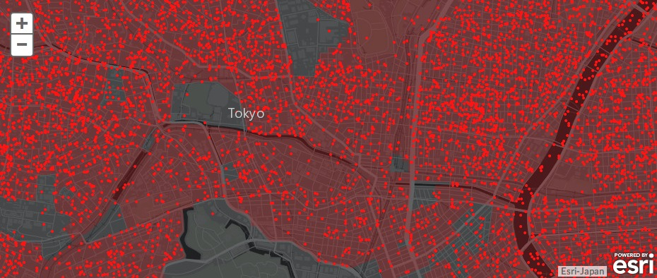

# How to use ArcGISBundle

## Installation
Activate the ArcGISBundle in your kernel

```php
// app/AppKernel.php
public function registerBundles()
{
    $bundles = array(
        // ...
        new Yuzu\ArcGISBundle\YuzuArcGISBundle(),
    );
}
```


## Create Simple WebMaps


In order to embed this map, paste this in your twig template:

 ```php
 {{ render(controller('YuzuArcGISBundle:ArcGIS:simpleMap', {
             'mapId': 'SFmap',
             'lat': 39.50,
             'long': -98.35,
             'zoom': 4,
             'layers':
             { 'PopulationDensity': 'http://server.arcgisonline.com/ArcGIS/rest/services/Demographics/USA_Population_Density/MapServer',
               'Noise': 'http://discomap.eea.europa.eu/arcgis/rest/services/NoiseWatch/NoiseWatch_Overview_WM/MapServer'
              } }))
 }}
 ```

- mapId: div identifier
- lat: center latitude
- long: center longitude
- zoom: zoom level (1 to 12)
- layers: public layer(s) to add to your map


## Integrate ArcGIS Online WebMaps
Create your maps on arcgis.com and integrate them in your Symfony2 application



_Source_: http://www.arcgis.com/home/webmap/viewer.html?webmap=6990a8c5e87b42ee80701cf985383d5d


### Create an account on arcgis.com
Before using this bundle you have to create a developer account on developer.arcgis.com.

1. Create an account
2. Create a basic application

### Create parameters.yml

1. Create parameters.yml in Resources/config based on parameters.yml.dist
2. Update arcgis_client_id with your client id on arcgis.com
3. Update arcgis_client_secret with your client secret on arcgis.com

### Update your twig templates

 ```php
  {{ render(controller('YuzuArcGISBundle:ArcGIS:ArcGisOnlineMap', {
            'mapId': 'ArcGisMap',
            'itemId': '6990a8c5e87b42ee80701cf985383d5d'}))
  }}
 ```

- mapId: div identifier
- itemId: item identifier on arcgis.com
